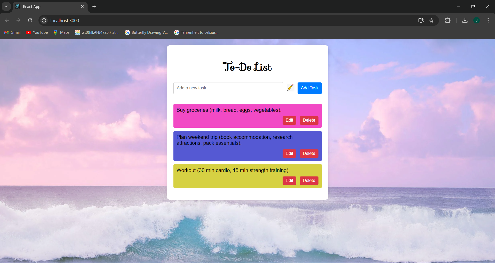

# To-Do List Application

This is a simple "To-Do List" application built using Flask for the backend and ReactJS for the frontend. The application allows users to add, delete, and view tasks,and also to pick a color for your task.

## Features

- Add tasks with different pencil colors
- Delete tasks
- View a list of tasks

## Backend (Flask)

### Installation

1. Clone the repository:

    ```bash
    git clone https://github.com/yourusername/flask-react-todo.git
    cd flask-react-todo
    ```

2. Set up a virtual environment and activate it:

    ```bash
    python -m venv venv
    source venv/bin/activate  # On Windows use `.\venv\Scripts\activate`
    ```

3. Install the required packages:

    ```bash
    pip install -r requirements.txt
    ```

4. Run the Flask server:

    ```bash
    python app.py
    ```

### API Endpoints

- **GET /tasks**: Retrieve the list of tasks
- **POST /tasks**: Add a new task
- **DELETE /tasks/:task_id**: Delete a task by ID

## Frontend (ReactJS)

### Installation

1. Navigate to the `frontend` directory:

    ```bash
    cd frontend
    ```

2. Install the required packages:

    ```bash
    npm install
    ```

3. Install Axios for making HTTP requests:

    ```bash
    npm install axios
    ```

4. Start the React development server:

    ```bash
    npm start
    ```

### Usage

1. Open your browser and navigate to `http://localhost:3000`.
2. Add tasks using the input field and the "Add Task" button.
3. Delete tasks using the "Delete" button next to each task.
4. Change the pencil color using the color picker.

### Screenshot



## License

This project is licensed under the MIT License. See the [LICENSE](LICENSE) file for details.

## Acknowledgements

- Flask: https://flask.palletsprojects.com/
- React: https://reactjs.org/
- Axios: https://github.com/axios/axios
